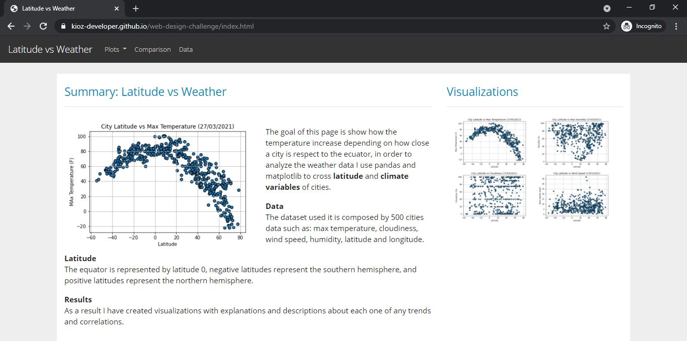
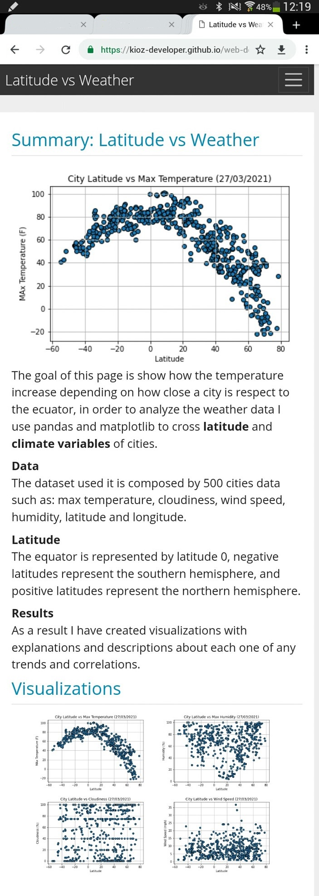
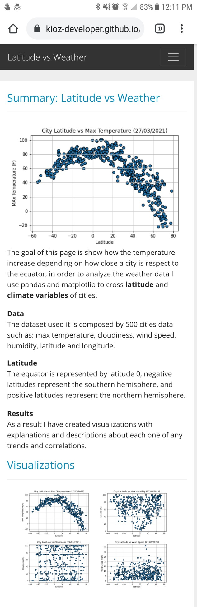

## Web Visualization Dashboard (Latitude vs Weather)

For this dashboard was needed to analyze the correlation between Latitude and Weather, for each plot a web page was created and linked in a common menu where we can navigate between them. These pages will contain the visualizations and their corresponding explanations. Furthermore in the landing page you can see a comparison of all of the plots or look at data page where you can view the data used to build them.

## Screenshots

This section contains screenshots of landing page on each device.

### Laptop

### Tablet

### Cell phone

